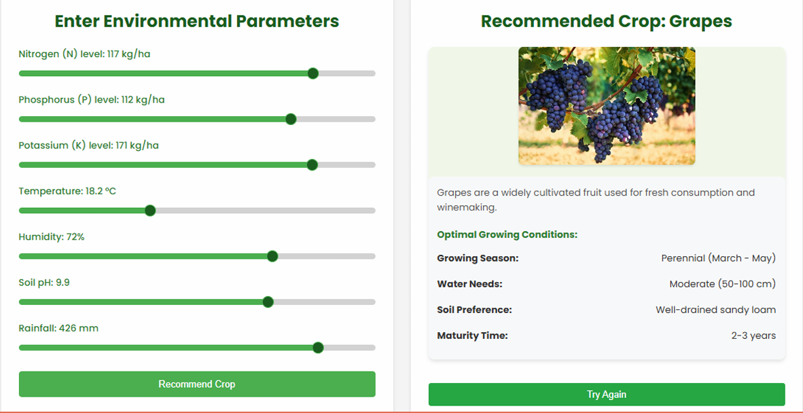

# 🌾 Crop Recommendation Web App

An ML-based web application that suggests suitable crops based on soil and climate data. The system evaluates multiple machine learning models and selects the best-performing one — **Random Forest** — for accurate crop prediction.

---

## 🚀 Tech Stack

- **Frontend:** HTML, CSS, JavaScript  
- **Backend:** Python Flask  
- **ML Model:** Random Forest (after evaluating multiple models)  

---

## 🧠 Features

- User-friendly UI to input soil and climate parameters  
- Real-time crop prediction using trained ML model  
- Displays recommended crop with high accuracy  
- Fast and interactive frontend with seamless Flask integration  

---

## 📊 Machine Learning Details

- Compared ML models: Logistic Regression, Decision Tree, SVM, Random Forest  
- **Random Forest** selected for its superior accuracy  
- Trained on dataset with features:  
  - Nitrogen (N)  
  - Phosphorus (P)  
  - Potassium (K)  
  - Temperature  
  - Humidity  
  - pH  
  - Rainfall  

---

## 🖼️ UI Preview
```md


